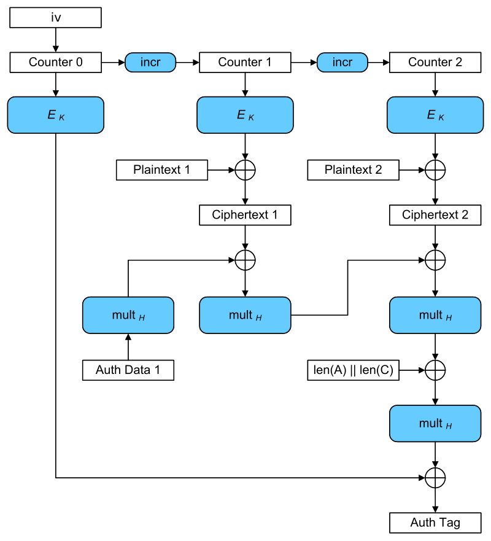

# Intro 
This weekend I participated in LACTF with my university. All of the challenges that I attempted were quite fun, and I've decided to do a writeup of the hardest challenge I solved, `goodhash`.
As always, I will try to walk through my thought process during the writeup instead of jumping straight to the solution.

# The Challenge

The challenge distribution consisted of the following file that runs on a remote server:
```python
from Crypto.Cipher import AES
import os

FLAG = REDACTED

if __name__ == "__main__":
    print("Can you guess the secret?")
    secret = os.urandom(16)
    key  = os.urandom(16)
    iv = os.urandom(12)
    for attempt in range(4):
        choice = input().strip()
        if choice == "1":
            leftextend = bytes.fromhex(input("input > "))
            rightextend = bytes.fromhex(input("input > "))
            cipher = AES.new(key, AES.MODE_GCM, nonce=iv)
            _, mac = cipher.encrypt_and_digest(leftextend + secret + rightextend)
            print(mac.hex())
        if choice == "2":
            guess = bytes.fromhex(input("guess > "))
            if guess == secret:
                print(FLAG)
            else:
                print("WRONG !!")
                exit()
    print("You're out of time!")
```

The primary idea of this challenge is that we are supposed to guess a secret 128-bit value based off 3 AES-GCM MACs for the secret key, padded on the left and right by some input.

# AES-GCM MAC? What's that?

This section details what a MAC is and how they're used. You can skip this section if you know what a MAC is.

In short, a message authentication code (MAC) is a small piece of data the is transmitted along with a ciphertext that will indicate if the message has been tampered with in transmission.
Any change to the ciphertext causes a (hopefully) unpredictable change in the MAC. Moreover, the MAC can only be computed if one has the encryption/decryption key, meaning an attacker
can't just recompute the MAC with their preferred ciphertext.

AES-GCM is a way of taking the AES block cipher and turning it into a method of both encryption and authentication (ie. a way to encrypt and produce a MAC). We'll dive into the details of how it works below.

# Galois Counter Mode
When I started this challenge, I didn't know how AES-GCM worked internally. Thankfully, this challenge was a great way to learn how it worked. All of the information below was taken from [wikipedia](https://en.wikipedia.org/wiki/Galois/Counter_Mode).

## AES-GCM Encryption
Encryption in AES-GCM is essentially *counter mode* for AES. Starting with a 96-bit nonce, a *keystream* is generated by encrypting $nonce || 1$, then $nonce || 2$, then $nonce || 3$...
where $||$ denotes concatenating the 96-bit nonce with a 32-bit counter. The keystream is then XOR'ed with the plaintext to produce the ciphertext.

## Generating the MAC
The interesting part is how the MAC is generated. Here, we split our ciphertext into 128-bit blocks, padding the last one with zeros if necessary. We then treat each block as an element of $GF(2^{128})$.

### What is GF(2^128)? Do you have 2^128 girlfriends?
$GF(2^{128})$ is an interesting mathematical structure consisting of $2^{128}$ different elements, each of which can be associated with a 128-bit number. We can add, subtract, multiply, and divide elements in $GF(2^{128})$, and get
another element of $GF(2^{128})$ (for the mathematically inclined, this is because $GF(2^{128})$ is a *field*). Addition in $GF(2^{128})$ isn't simply adding the associated numbers though - it's XORing them. Multiplication in 
$GF(2^{128})$ is a more complicated operation, the details of which are not too important. Subtraction and division are defined to invert addition and multiplication. Crucially, since XOR is its own inverse,
addition and subtraction in $GF(2^{128})$ are the same operation, which is XOR.

One might be a little confused as to why they're called addition and multiplication then. The reason is that, in $GF(2^{128})$, they behave exactly like addition and multiplication would. In particular, we have the distributive
property: $a(b + c) = ab + ac$. We can do all of our techniques from high school algebra that we know and love in the world of $GF(2^{128})$. And indeed, that's what we'll do.

### MACs with GF(2^128)

With that information, let's dive into the details of how the MAC is generated. First, a value $H$ is generated by encrypting all zeros with the encryption key, and interpreting it as an element of $GF(2^{128})$.

Then, we line up our 128-bit ciphertext blocks in order (or, if there's additional unencrypted data we want to authenticate, put those blocks at the beginning). At the end, we put 
$len(A) || len(C)$, where $len(A)$ is the length of the unencrypted data we want to authenticate (there's none in this challenge), and $len(C)$ is the length of the unpadded ciphertext.

Then, we multiply the first block by $H$, then add (read: XOR) it with the second block. Then we multiply by $H$ again, add the third block, and so on until we've gotten through all of our blocks.
Finally, we encrypt $nonce || 0$ and add it to the result. That becomes our MAC.

The following diagram from wikipedia shows what this looks like graphically.



# Back to the challenge

## The approach
Okay, that's a lot of information. How does it apply to the challenge? The first thing I realized is that the MAC (which is the only thing we're given) is a polynomial function of the inputs. That is, it's all
just additions and multiplications, albeit in $GF(2^{128})$. Since the nonce is reused for each MAC, the only input that differs between our 3 MACs we compute will be the plaintext itself, which we have some control over.

I formulated the following plan:
- Express each MAC computation as a polynomial function of $H$, the target secret $s$, any extensions $l$ and $r$, and the encryptions of $nonce || 0$, $nonce || 1$, $nonce || 2$... (which we denote $e_0$, $e_1$, ...)
- Use algebra to solve for $s$.

At first, I wasn't sure if this would work. We only have 3 MACs, but even in the smallest case $H$, $s$, $e_0$, and $e_1$ are all unknown. 4 unknowns in 3 equations is not promising for being able to solve for one.
Nonetheless, I tried to see how much information I could get from this approach, in order to see what roadblocks I'd hit.

## Formulating the MAC

The key part to this challenge was the fact that we could pad the left and right of the secret being encrypted by arbitrary data. Clearly, we want to keep our ciphertext's length under 32 bytes, since increasing it any
further will introduce additional variables $e_3$ and so on. The simples case to deal with is probably the one where we keep the secret in its own block, so let's try padding it on the right with $p_0$ and $p_1$.

First, note the ciphertext blocks are just $e_1 + s$ and $e_2 + r_i$. We also denote $len(A) || len(C)$ as $n$.

$$
    MAC_0 = (((e_1 + s)H + e_2 + p_0)H + n)H + e_0 = e_1 H^3 + s H^3 + e_2 H^2 + p_0 H^2 + nH + e_0
$$
$$
    MAC_1 = (((e_1 + s)H + e_2 + p_1)H + n)H + e_0 = e_1 H^3 + s H^3 + e_2 H^2 + p_1 H^2 + nH + e_0
$$

Hmm... those are looking *very* similar. If we add them, we get just $MAC_0 + MAC_1 = H^2 (p_0 + p_1)$. Since we set $p_0$ and $p_1$, we can solve for $H$! In particular, $H^2 = (MAC_0 + MAC_1) / (p_0 + p_1)$.
We have to take a square root, but luckily in $GF(2^{128})$ square roots are actually unique (I think). 

With two of our 3 MACS, we can compute $H$. Let's see what we can do with our third MAC. My guess is that we'll need to reuse some of the same padding to get things to simplify, so let's try sending $p_0 || s$ instead of $s || p_0$.

$$
    MAC_2 = (((e_1 + p_0)H + e_2 + s)H + n)H + e_0 = e_1 H^3 + p_0 H^3 + e_2 H^2 + s H^2 + nH + e_0
$$

Again, very similar terms, so let's add $MAC_0$ and $MAC_2$:
$$
    MAC_2 + MAC_0 = H^3 (s + p_0) + H^2 (s + p_0)
$$

Since we know $H$ and $r$, we can solve for $s$, which is exactly what we need! 

To summarize, what we'll do is:
- Request $MAC_0$ and $MAC_1$ where `leftextend` is `""` and `rightextend` is $p_0$ and $p_1$ respectively. Calculate $H = \sqrt{(MAC_0 + MAC_1) / (p_0 + p_1)}$. 
- Request $MAC_2$ so `leftextend` is $p_0$ and `rightextend = ""`. Calculate $s = \frac{MAC_0 + MAC_2}{H^3 + H^2} + p_0$
- Send back $s$ to get the flag!

# Putting it into practice
Now that we have an attack plan that (should work), let's actually write a solve script. I used sagemath to handle the computations in $GF(2^{128})$. We need some conversion functions to go between the hex representation
and $GF(2^{128})$ first.

```python

R.<x> = GF(2^{128}) # by default, sage uses the same modulus for GF(2^{128}) as GCM mode, which is nice.

def int_to_gf(i):
    b = bin(i)[2:].rjust(128, '0')
    y = R(list(map(int, list(b))))
    return y

def gf_to_hex(n):
    l = list(n.polynomial())
    l = l + ([0] * (128 - len(l)))
    b = ''.join(map(str, l))
    return hex(int(b, 2))
```

Two things: sage represents elements of $GF(2^{128})$ as polynomials, so to convert from $GF(2^{128})$ to hex we need to look at the coefficients of the polynomial, which are either $0$ or $1$. Additionally, we need to mind
padding when converting to and from.

Next, we choose $p_0$ and $p_1$. Our approach allows them to be anything that's 16 bytes long.

```python
p0 = int_to_gf(int("1"*32, 16))
p1 = int_to_gf(int("1"*31 + '0', 16))
```

We then send the chosen extensions:

```python
io = process(["python", "orig.py"])

# ct0 = s || p_0
io.sendline(b'1')
io.sendlineafter(b"input > ", b"")
io.sendlineafter(b"input > ", b'1'*32)
ct0 = int(io.recvline(), 16)

# ct1 = s || p_1
io.sendline(b'1')
io.sendlineafter(b"input > ", b"")
io.sendlineafter(b"input > ", b'1'*31 + b'0')
ct1 = int(io.recvline(), 16)

# ct2 = p_0 || s
io.sendline(b'1')
io.sendlineafter(b"input > ", b'1'*32)
io.sendlineafter(b"input > ", b"")
ct2 = int(io.recvline(), 16)


```

Finally, we do the computations above and send it back:

```python
# ct1 ^ ct2
H2 = (int_to_gf(ct0) + int_to_gf(ct1)) / (p0 + p1)
H = H2.square_root()

s = int_to_gf(ct0 ^^ ct2) / (H^3 + H^2) - p0

io.sendline(b'2')
io.sendline(gf_to_hex(s)[2:])

io.interactive()
```

In total:
```python
from Crypto.Cipher import AES
from Crypto.Util.number import long_to_bytes, bytes_to_long
from pwn import *

R.<x> = GF(2^{128}) # by default, sage uses the same modulus for GF(2^{128}) as GCM mode, which is nice.

def int_to_gf(i):
    b = bin(i)[2:].rjust(128, '0')
    y = R(list(map(int, list(b))))
    return y

def gf_to_hex(n):
    l = list(n.polynomial())
    l = l + ([0] * (128 - len(l)))
    b = ''.join(map(str, l))
    return hex(int(b, 2))


p0 = int_to_gf(int("1"*32, 16))
p1 = int_to_gf(int("1"*31 + '0', 16))

#io = remote("chall.lac.tf", 32222)
io = process(["python", "server.py"])
print(io.recvline())
print(io.recvline())

# ct0 = s || p_0
io.sendline(b'1')
io.sendlineafter(b"input > ", b"")
io.sendlineafter(b"input > ", b'1'*32)
ct0 = int(io.recvline(), 16)

# ct1 = s || p_1
io.sendline(b'1')
io.sendlineafter(b"input > ", b"")
io.sendlineafter(b"input > ", b'1'*31 + b'0')
ct1 = int(io.recvline(), 16)

# ct2 = p_0 || s
io.sendline(b'1')
io.sendlineafter(b"input > ", b'1'*32)
io.sendlineafter(b"input > ", b"")
ct2 = int(io.recvline(), 16)

H2 = (int_to_gf(ct0) + int_to_gf(ct1)) / (p0 + p1)
H = H2.square_root()

s = int_to_gf(ct0 ^^ ct2) / (H^3 + H^2) - p0

io.sendline(b'2')
io.sendline(gf_to_hex(s)[2:].encode())

io.interactive()
```

# Some pitfalls and comments
There were a couple issues and notes I had while trying to solve this challenge. Most were more implementation-related rather than approach-related, but it's worth detailing them anyways.
- I initially made an algebra mistake when writing out the MAC formulae, which made me think that the approach I outlined wouldn't work. I spent a little time trying to think of alternate ways to combine the expressions
to get terms to cancel before realizing my mistake.
- When I first made the `gf_to_hex` function, I didn't pad the polynomial with zeros, which turned out to cause some issues. Then I padded the polynomial with zeros on the wrong side, which also caused issues sometimes.
- To help make sure I was getting the intermediate steps correct, I modified the challenge to print out both the ciphertexts and the value of $H$. This was helpful in debugging.
- I initially was concerned about the square root operation in $GF(2^{128})$, but luckily sage has a builtin for that. Sage is amazing!

# Final thoughts

This was a really fun challenge. I'm a huge fan of any crypto challenge that features symmetric cryptography, even if it's treated as a black box the way AES is treated in the challenge. Overall very fun, and I learned
about how GCM mode worked too, which was neat. Thanks to `freed` for writing this challenge!
