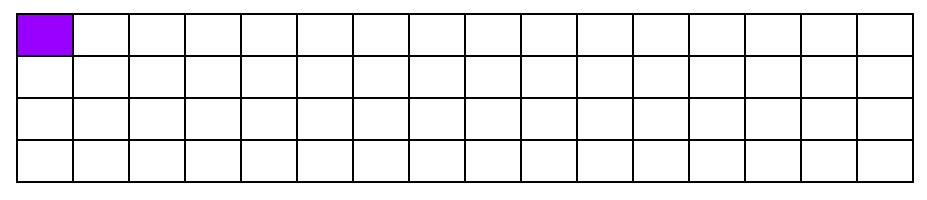
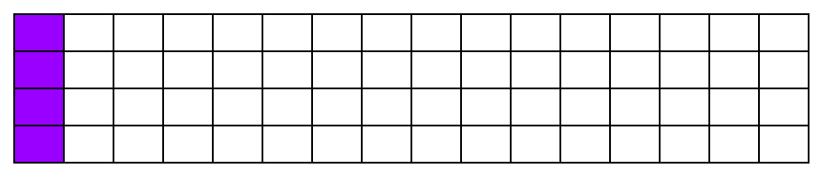
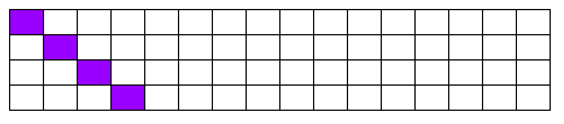
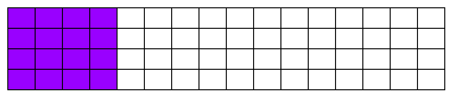
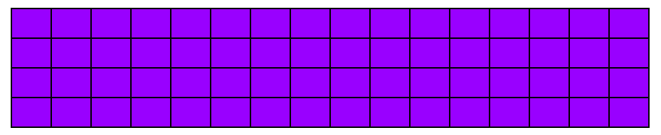
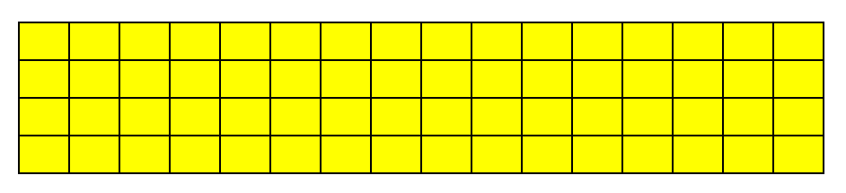
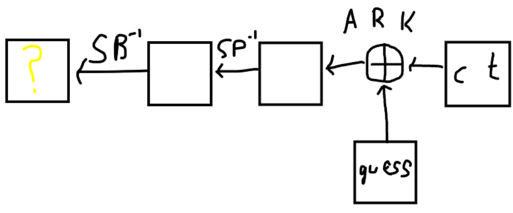

# Intro

`haes` and `haes-2` were two crypto challenges I wrote for UMDCTF 2024. They ended up getting 4 and 2 solves respectively, which was less than I had expected.

Both challenges were based off a modified version of AES that operated on a 4x4x4 state matrix rather than the usual 4x4 state matrix of AES. However, many of the operations
remained the same, making it vulnerable to the same types of attacks as AES. The challenges were meant to be introductions to some common block cipher attack techniques, so they
were fairly "by the book" if you knew where to look. Next year I'll probably aim to do some more unique challenges in that regard.


# HAES (the first one)

[Here's](https://github.com/UMD-CSEC/UMDCTF-2024-Challenges/tree/main/crypto/haes) the repo associated with this challenge.

This version of the challenge used 5 rounds of HAES. All the operations of a round of HAES are same as AES, except for the `shift_rows` step, which is instead replaced with 
a larger permutation (`shift_planes` in the code). You were given 511 chosen plaintexts and an encrypted flag. The intended solution was integral cryptanalysis.

## "Integral cryptanalysis? What's that?"

The idea of integral cryptanalysis is to send a multiset of ciphertexts that has a special property that is preserved as much as possible by the operations of a block cipher.
If we can get this property to persist through several rounds of the block cipher, then we have a way to distinguish whether or not an internal block cipher state is possible from the given plaintexts.
If the special property persists all the way to the last `add_round_key` step, then can make deductions on the last round key's bytes based on whether XORing them with the ciphertexts
gives a valid state.

## So how does it work here?
Luckily, there's a well-documented integral cryptanalysis attack on AES that translates perfectly into this scenario. I am very closely following the explanation of [this page](https://www.davidwong.fr/blockbreakers/square_2_attack4rounds.html),
which excellently explains the attack on AES.

Our initial set of ciphertexts is a set of 256 ciphertexts which all differ in the first byte only. Moreover, that first byte takes every possible value in our set (sometimes referred to as a lambda-set).
We call any byte position that takes every possible value an "active byte". To start, only the first byte is active - the rest are inactive, meaning bytes in that position are equal in our lambda-set.


## Round 1
Let's look at the first round of HAES: `add_round_key -> sub_bytes -> shift_planes -> mix_columns -> add_round_key`.

I'll use the following picture to denote our state. Instead of drawing a 4x4x4 array, I will use a 16x4 array (so the `shift_planes` step just becomes a row permutation). Active bytes are in purple, and inactive bytes are white.



After the `add_round_key` and `sub_bytes_steps` the active byte remains active, and the inactive bytes remain inactive. This is because these transformations are one-to-one and operate byte-by-byte.

After the `shift_planes` step, we still have the same picture, since the `shift_planes` step fixes the first byte.

Then, there's a `mix_columns` step. `mix_columns` is a more complicated operation operating on the columns of our state rather than the individual bytes. Right now, all you need to know is mixing the first column makes
all the bytes active in that column. We finish with an `add_round_key` which preserves active and inactive bytes as established. So, going into round 2, we have this:



## Round 2
Round two consists of `sub_bytes -> shift_planes -> mix_columns -> add_round_key`. We've already established that `sub_bytes` does nothing to our set, so let's go onto `shift_planes`.

Here, our active bytes are now moved around. I'm not sure what the exact permutation from the code looks like, so I'll illustrate with an equivalent permutation. The bytes that were previously all in the same column
are moved to a different column.



The `mix_columns` comes next, which turns our 4 active bytes into 16.



Finally, `add_round_key` preserves the picture.

## Round 3

The same process happens in round 3, and we end up with all 64 bytes being active after the 4th `add_round_key`.



Let's recap what this means: in our set of 256 states, each byte position takes all possible values. This is extremely unlikely to occur with random 256 plaintexts, meaning we might have some use information still.

## Round 4
The `sub_bytes` keeps all of our active bytes active, and the `shift_planes` does nothing to our picture either since every byte is active. However, as we arrive at `mix_columns`, we run into an issue: we're mixing 4 active
bytes together, which results in bytes that are no longer active or inactive in our terminology. However, there is a weaker property that holds: the XOR-sum of the bytes in each position is still 0. This is because `mix_columns`
is linear with respect to the XOR operation. We'll denote this weaker property with a yellow byte.



The `add_round_key` operation still preserves our yellow bytes, so we're good to move onto the final round.


## Round 5
Round 5 consists of `sub_bytes -> shift_planes -> add_round_key`. The last `mix_columns` is omitted just like regular AES, since it turns out not to affect security.

Immediately, we run into trouble. The `sub_bytes` operation is not linear (it's the only AES operation that's not), so our lovely yellow bytes lose their nice XOR-sum property. However, up until the final s-box, we have a way
to distinguish possible states from impossible states.


## Round 5... but backwards
Let's work in the opposite direction. We have an `add_round_key` operation first (err... last), which we can't really unwind without the round key. We can, however, guess each byte individually.
When we do this, we can unwind the `shift_planes` and `sub_bytes` operations, meeting up with our progress in the forward direction. 

So what does this mean? Well, if we guess a round key byte, undo the `shift_planes` and `sub_bytes` operations on the corresponding byte position in our final set of ciphertexts, we can check the XOR-sum property.
If they XOR-sum to 0, our guess is possibly correct. If not, our guess is definitely incorrect, since we know that the bytes have the zero XOR-sum before the last s-box.

The process is illustrated in the following low-quality diagram:



But what do we do with our other 255 plaintexts? Are they necessary?

## Do it again!

This way to filter key byte guesses gives us 1 to 4 possible round key bytes in practice. Unfortunately, this multiplies up quickly in our scenario, since the round key is 64 bytes long. Luckily, if we mount the attack
again, but this time with the second byte different rather than the first, we will get another set of guesses, and so we can just take the intersection to get almost always 1 guess per position.

After that, it's a matter of inverting the round key, which is a non-trivial process but it's well-documented enough online that I won't get into it now.

## The solve script:

```python
import os
import itertools

from pwn import *

N_ROUNDS = 5

def expand_key(master_key):
    """
    Expands and returns a list of key matrices for the given master_key.
    """

    # Round constants https://en.wikipedia.org/wiki/AES_key_schedule#Round_constants
    r_con = (
        0x00, 0x01, 0x02, 0x04, 0x08, 0x10, 0x20, 0x40,
        0x80, 0x1B, 0x36, 0x6C, 0xD8, 0xAB, 0x4D, 0x9A,
        0x2F, 0x5E, 0xBC, 0x63, 0xC6, 0x97, 0x35, 0x6A,
        0xD4, 0xB3, 0x7D, 0xFA, 0xEF, 0xC5, 0x91, 0x39,
    )

    # Initialize round keys with raw key material.
    key_columns = [list(master_key[4*i:4*i+4]) for i in range(16)]
    #print(key_columns)

    iteration_size = len(master_key) // 4

    # Each iteration has exactly as many columns as the key material.
    i = 1
    while len(key_columns) < (N_ROUNDS + 1) * 16:
        # Copy previous word.
        word = key_columns[-1].copy()
        # Perform schedule_core once every "row".
        if len(key_columns) % iteration_size == 0:
            # Circular shift
            word.append(word.pop(0))
            # Map to S-BOX.
            word = [s_box[b] for b in word]
            # XOR with first byte of R-CON, since the others bytes of R-CON are 0.
            word[0] ^= r_con[i]
            i += 1

        # XOR with equivalent word from previous iteration.
        word = [i^j for i, j in zip(word, key_columns[-iteration_size])]
        key_columns.append(word)

    full_key_stream = [ kb for key_column in key_columns for kb in key_column ]
    return [full_key_stream[i*64:(i+1)*64] for i in range(0,N_ROUNDS + 1, 1)]

def bytes_to_state(text):
    return [ [ [text[i+j+k] for k in range(4) ] for j in range(0, 16, 4) ] for i in range(0, 64, 16)]

def state_to_bytes(state):
    arr = [0] * 64

    for i in range(4):
        for j in range(4):
            for k in range(4):
                arr[16*i+4*j+k] = state[i][j][k]

    return bytes(arr)


def add_round_key(s, rk):
    new_state = [[[0 for _ in range(4)] for _ in range(4)] for _ in range(4)]

    for i in range(4):
        for j in range(4):
            for k in range(4):
                new_state[i][j][k] = s[i][j][k] ^ rk[16*i+4*j+k]

    return new_state


s_box = [
    0x63, 0x7C, 0x77, 0x7B, 0xF2, 0x6B, 0x6F, 0xC5, 0x30, 0x01, 0x67, 0x2B, 0xFE, 0xD7, 0xAB, 0x76,
    0xCA, 0x82, 0xC9, 0x7D, 0xFA, 0x59, 0x47, 0xF0, 0xAD, 0xD4, 0xA2, 0xAF, 0x9C, 0xA4, 0x72, 0xC0,
    0xB7, 0xFD, 0x93, 0x26, 0x36, 0x3F, 0xF7, 0xCC, 0x34, 0xA5, 0xE5, 0xF1, 0x71, 0xD8, 0x31, 0x15,
    0x04, 0xC7, 0x23, 0xC3, 0x18, 0x96, 0x05, 0x9A, 0x07, 0x12, 0x80, 0xE2, 0xEB, 0x27, 0xB2, 0x75,
    0x09, 0x83, 0x2C, 0x1A, 0x1B, 0x6E, 0x5A, 0xA0, 0x52, 0x3B, 0xD6, 0xB3, 0x29, 0xE3, 0x2F, 0x84,
    0x53, 0xD1, 0x00, 0xED, 0x20, 0xFC, 0xB1, 0x5B, 0x6A, 0xCB, 0xBE, 0x39, 0x4A, 0x4C, 0x58, 0xCF,
    0xD0, 0xEF, 0xAA, 0xFB, 0x43, 0x4D, 0x33, 0x85, 0x45, 0xF9, 0x02, 0x7F, 0x50, 0x3C, 0x9F, 0xA8,
    0x51, 0xA3, 0x40, 0x8F, 0x92, 0x9D, 0x38, 0xF5, 0xBC, 0xB6, 0xDA, 0x21, 0x10, 0xFF, 0xF3, 0xD2,
    0xCD, 0x0C, 0x13, 0xEC, 0x5F, 0x97, 0x44, 0x17, 0xC4, 0xA7, 0x7E, 0x3D, 0x64, 0x5D, 0x19, 0x73,
    0x60, 0x81, 0x4F, 0xDC, 0x22, 0x2A, 0x90, 0x88, 0x46, 0xEE, 0xB8, 0x14, 0xDE, 0x5E, 0x0B, 0xDB,
    0xE0, 0x32, 0x3A, 0x0A, 0x49, 0x06, 0x24, 0x5C, 0xC2, 0xD3, 0xAC, 0x62, 0x91, 0x95, 0xE4, 0x79,
    0xE7, 0xC8, 0x37, 0x6D, 0x8D, 0xD5, 0x4E, 0xA9, 0x6C, 0x56, 0xF4, 0xEA, 0x65, 0x7A, 0xAE, 0x08,
    0xBA, 0x78, 0x25, 0x2E, 0x1C, 0xA6, 0xB4, 0xC6, 0xE8, 0xDD, 0x74, 0x1F, 0x4B, 0xBD, 0x8B, 0x8A,
    0x70, 0x3E, 0xB5, 0x66, 0x48, 0x03, 0xF6, 0x0E, 0x61, 0x35, 0x57, 0xB9, 0x86, 0xC1, 0x1D, 0x9E,
    0xE1, 0xF8, 0x98, 0x11, 0x69, 0xD9, 0x8E, 0x94, 0x9B, 0x1E, 0x87, 0xE9, 0xCE, 0x55, 0x28, 0xDF,
    0x8C, 0xA1, 0x89, 0x0D, 0xBF, 0xE6, 0x42, 0x68, 0x41, 0x99, 0x2D, 0x0F, 0xB0, 0x54, 0xBB, 0x16,
]

inv_s_box = [s_box.index(i) for i in range(256)]

def sub_bytes(s):
    new_state = [[[0 for _ in range(4)] for _ in range(4)] for _ in range(4)]

    for i in range(4):
        for j in range(4):
            for k in range(4):
                new_state[i][j][k] = s_box[s[i][j][k]]

    return new_state


def inv_sub_bytes(s):
    new_state = [[[0 for _ in range(4)] for _ in range(4)] for _ in range(4)]

    for i in range(4):
        for j in range(4):
            for k in range(4):
                new_state[i][j][k] = inv_s_box[s[i][j][k]]

    return new_state

def shift_planes(s):
    new_state = [[[0 for _ in range(4)] for _ in range(4)] for _ in range(4)]
    for i in range(4):
        for j in range(4):
            for k in range(4):
                new_state[(i+j) % 4][(j+k) % 4][k] = s[i][j][k]
    return new_state

def inv_shift_planes(s):
    new_state = [[[0 for _ in range(4)] for _ in range(4)] for _ in range(4)]
    for i in range(4):
        for j in range(4):
            for k in range(4):
                new_state[i][j][k] = s[(i+j)%4][(j+k)%4][k]
    return new_state

xtime = lambda a: (((a << 1) ^ 0x1B) & 0xFF) if (a & 0x80) else (a << 1)


def mix_single_column(a):
    # see Sec 4.1.2 in The Design of Rijndael
    t = a[0] ^ a[1] ^ a[2] ^ a[3]
    b = [x for x in a] # copy
    u = a[0]
    b[0] ^= t ^ xtime(a[0] ^ a[1])
    b[1] ^= t ^ xtime(a[1] ^ a[2])
    b[2] ^= t ^ xtime(a[2] ^ a[3])
    b[3] ^= t ^ xtime(a[3] ^ u)
    return b


def mix_columns(s):
    new_state = [[[0 for _ in range(4)] for _ in range(4)] for _ in range(4)]

    for i in range(4):
        for j in range(4):
            new_state[i][j] = mix_single_column(s[i][j])
    return new_state


def inv_mix_columns(s):
    new_state = [[[0 for _ in range(4)] for _ in range(4)] for _ in range(4)]

    # see Sec 4.1.3 in The Design of Rijndael
    for i in range(4):
        for j in range(4):
            u = xtime(xtime(s[i][j][0] ^ s[i][j][2]))
            v = xtime(xtime(s[i][j][1] ^ s[i][j][3]))
            new_state[i][j][0] = s[i][j][0] ^ u
            new_state[i][j][1] = s[i][j][1] ^ v
            new_state[i][j][2] = s[i][j][2] ^ u
            new_state[i][j][3] = s[i][j][3] ^ v

    return mix_columns(new_state)

def encrypt(key, plaintext):
    round_keys = expand_key(key)

    state = bytes_to_state(plaintext)

    state = add_round_key(state, round_keys[0])

    for i in range(1, N_ROUNDS):
        state = sub_bytes(state)
        state = shift_planes(state)
        state = mix_columns(state)
        state = add_round_key(state, round_keys[i])


    state = sub_bytes(state)
    state = shift_planes(state)
    state = add_round_key(state, round_keys[N_ROUNDS])

    return state_to_bytes(state)

def decrypt(key, ciphertext):
    round_keys = expand_key(key)

    state = bytes_to_state(ciphertext)

    state = add_round_key(state, round_keys[N_ROUNDS])

    for i in range(N_ROUNDS-1, 0, -1):
        state = inv_shift_planes(state)
        state = inv_sub_bytes(state)
        state = add_round_key(state, round_keys[i])
        state = inv_mix_columns(state)


    state = inv_shift_planes(state)
    state = inv_sub_bytes(state)
    state = add_round_key(state, round_keys[0])

    return state_to_bytes(state)


def xor_add(b1, b2):
    return [x ^ y for x,y in zip(b1, b2)]


def inv_expand_key(rk, round):
    r_con = (
        0x00, 0x01, 0x02, 0x04, 0x08, 0x10, 0x20, 0x40,
        0x80, 0x1B, 0x36, 0x6C, 0xD8, 0xAB, 0x4D, 0x9A,
        0x2F, 0x5E, 0xBC, 0x63, 0xC6, 0x97, 0x35, 0x6A,
        0xD4, 0xB3, 0x7D, 0xFA, 0xEF, 0xC5, 0x91, 0x39,
    )

    cur_round_key = rk

    rounds_left = round
    while rounds_left > 0:
        # undo round
        # calculate the easy columns
        prev_round_key = [0] * 64
        
        for i in range(15, 0, -1):
            prev_round_key[i*4:(i+1)*4] = xor_add(cur_round_key[i*4:(i+1)*4], cur_round_key[(i-1)*4:i*4])

        word = prev_round_key[-4:]
        # shift
        word = word[1:] + [word[0]]
        # Map to S-BOX.
        word = [s_box[b] for b in word]
        # XOR with first byte of R-CON, since the others bytes of R-CON are 0.
        word[0] ^= r_con[rounds_left]

        prev_round_key[0:4] = xor_add(cur_round_key[0:4], word)

        cur_round_key = prev_round_key

        rounds_left -= 1
    return cur_round_key


if __name__ == "__main__":

    io = process(['python', 'haes.py'])

    lambda_set = [[i] + [0] * 63 for i in range(256)]
    full_pt = b''
    for pt in lambda_set:
        full_pt += bytes(pt)

    lambda_set2 = [[0, i] + [0] * 62 for i in range(1, 256)]
    for pt in lambda_set2:
        full_pt += bytes(pt)

    io.recvuntil(b"Flag: ")
    flag = bytes.fromhex(io.recvline(keepends=False).decode())
    io.sendlineafter(b"here: \n", bytes.hex(full_pt).encode())
    io.recvuntil("message:\n")
    response = io.recvline(keepends=False)

    response = bytes.fromhex(response.decode()) 

    lambda_set2 = [[0]*64] + lambda_set2

    lambda_ct_set = [list(response[i:i+64]) for i in range(0, 256*64, 64)]
    lambda_ct_set2 = [list(response[0:64])] + [list(response[i:i+64]) for i in range(256*64, 511*64, 64)]


    key_guesses = [[] for _ in range(64)]
    permutation_lookup = list(range(64))
    permutation_lookup = bytes_to_state(bytes(permutation_lookup))
    permutation_lookup = inv_shift_planes(permutation_lookup)
    for i in range(4):
        for j in range(4):
            for k in range(4):
                guess_pos = permutation_lookup[i][j][k]
                kb_guesses = []
                for kb in range(256):
                    xor_sum1 = 0
                    xor_sum2 = 0
                    for ct1, ct2 in zip(lambda_ct_set, lambda_ct_set2):
                        guessing_byte1 = ct1[guess_pos]
                        guessing_byte1 ^= kb
                        guessing_byte1 = inv_s_box[guessing_byte1]
                        xor_sum1 ^= guessing_byte1

                        guessing_byte2 = ct2[guess_pos]
                        guessing_byte2 ^= kb
                        guessing_byte2 = inv_s_box[guessing_byte2]
                        xor_sum2 ^= guessing_byte2
                    if xor_sum1 == 0 and xor_sum2 == 0:
                        kb_guesses.append(kb)
                key_guesses[guess_pos] = kb_guesses

    print(key_guesses)
    for key_guess in itertools.product(*key_guesses):
        print(decrypt(bytes(inv_expand_key(key_guess, 5)), flag))

```


# HAES 2

TODO
